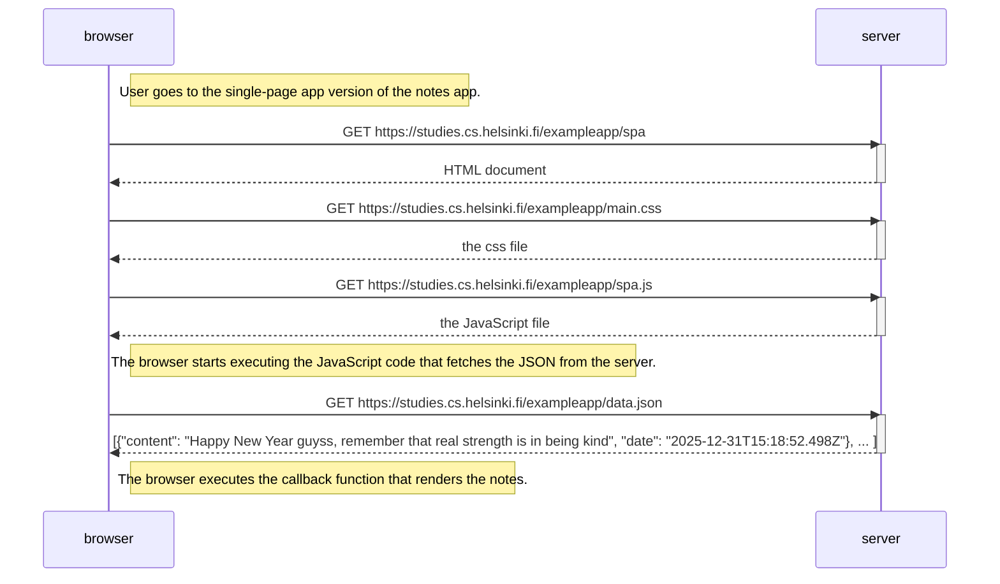

```mermaid
    sequenceDiagram
    participant browser
        participant server

        Note right of browser: User goes to the single-page app version of the notes app.

        browser->>server: GET https://studies.cs.helsinki.fi/exampleapp/spa
        activate server
        server-->>browser: HTML document
        deactivate server

        browser->>server: GET https://studies.cs.helsinki.fi/exampleapp/main.css
        activate server
        server-->>browser: the css file
        deactivate server

        browser->>server: GET https://studies.cs.helsinki.fi/exampleapp/spa.js
        activate server
        server-->>browser: the JavaScript file
        deactivate server

        Note right of browser: The browser starts executing the JavaScript code that fetches the JSON from the server.

        browser->>server: GET https://studies.cs.helsinki.fi/exampleapp/data.json
        activate server
        server-->>browser: [{"content": "Happy New Year guyss, remember that real strength is in being kind", "date": "2025-12-31T15:18:52.498Z"}, ... ]
        deactivate server

        Note right of browser: The browser executes the callback function that renders the notes.
```