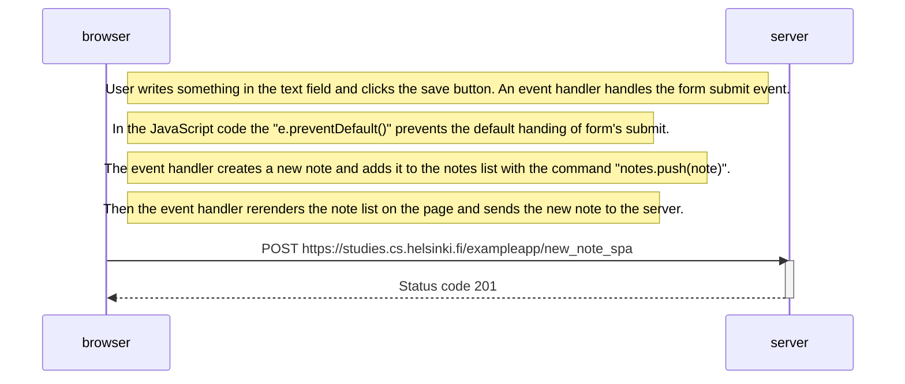

```mermaid
    sequenceDiagram
        participant browser
        participant server

        Note right of browser: User writes something in the text field and clicks the save button. An event handler handles the form submit event.

        
        Note right of browser: In the JavaScript code the "e.preventDefault()" prevents the default handing of form's submit.

        Note right of browser: The event handler creates a new note and adds it to the notes list with the command "notes.push(note)".

        Note right of browser: Then the event handler rerenders the note list on the page and sends the new note to the server.

        browser->>server: POST https://studies.cs.helsinki.fi/exampleapp/new_note_spa
        activate server
        server-->>browser: Status code 201
        deactivate server
```